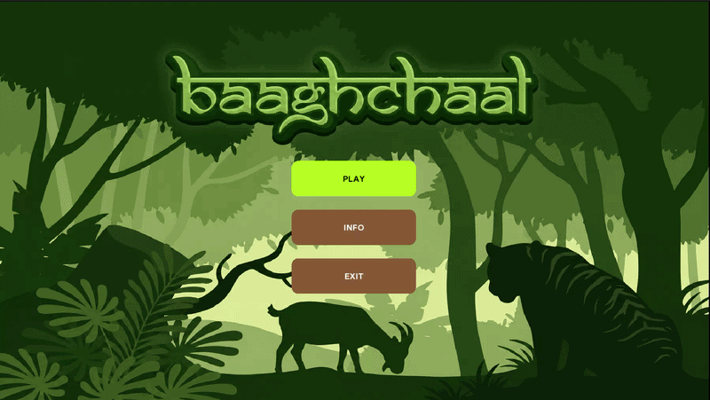
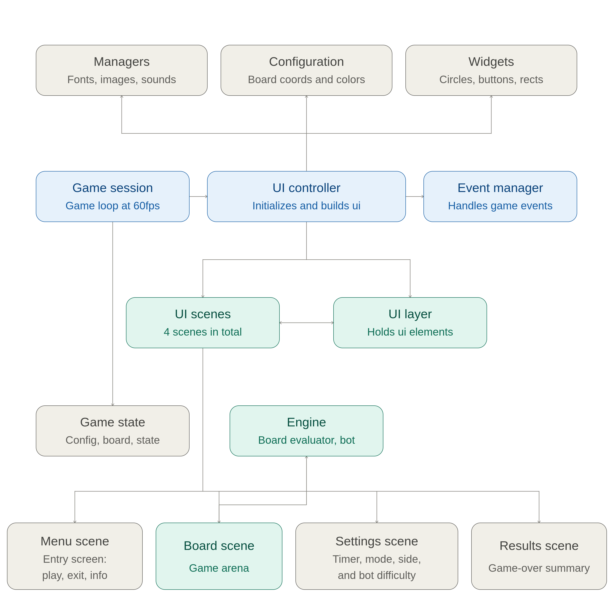
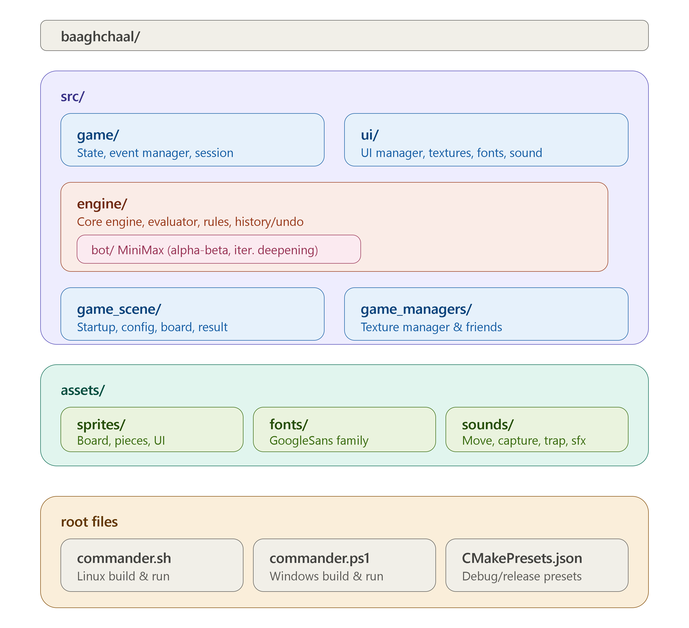

# BaaghChaal - Baagh Vs Baakhra

> A traditional Nepalese board game, rebuilt in **C++** with **SDL3**.
> Four tigers hunt twenty goats across a 5×5 grid - the goats need to trap them all.



---

## About the Game

**BaaghChaal** [ बाघचाल ] is one of the oldest folk games of Nepal - a battle of baaghs [ tigers ] and baakhras [ goats ]. It is a two-player strategy board game played on a 5×5 interconnected board. The game consists of four tigers and twenty goats, where the tigers aim to capture goats while the goats aim to trap the tigers so that they have no moves left to go. Goats are placed onto the board gradually, while tigers can move between connected positions and capture goats by jumping over them into an empty position. Players take turns making moves, and the game ends when the tigers capture enough goats or the goats successfully trap all four tigers. <br>
This game was made as the ***I/II*** part Cpp project.
<br>
<br>***Team Members***<br>
Brishkamal Karki<br>
Bishesh Khatri<br>
Chandan Kumar Panjiyaar <br>


### How to Win

| Player  | Win condition |
|---------|---------------|
| Tigers | Capture **5 goats** (jump over an adjacent goat onto an empty square) |
|  Goats | **Trap all 4 tigers** so none has a single legal move |


---

## Features

- **Player vs Player** - two-player mode from a single computer
- **Player vs Bot** - a minimax AI with ***alpha-beta pruning*** 
- **Adjustable bot difficulty** - Easy, Medium, Hard
- **Per-move timer** - 15 / 30 / 45 seconds per move; run out of time and you lose the move
- **Pause menu** - resume, jump to the main menu, or quit
- **Move highlighting** - legal destination points light up when you select a piece
- **Undo** - step back through the game (up to 9 levels; in bot mode one undo rewinds a full round)
- **Win detection** - both victory conditions are checked automatically
- **Sound effects** - captures, traps, moves, and game start/end
- **Clean SDL3 UI** - textures, fonts, and a polished board rendering

---


## Architecture

### System Architecture


### File Architecture


---

## Installation & Build

### Dependencies

| Dependency | Purpose |
|------------|---------|
| **CMake ≥ 3.28.3** | Build system |
| **C++** | Language standard |
| **SDL3** | Windowing, input, rendering |
| **SDL3_image** | Image loading |
| **SDL3_ttf** | Font rendering |
| **SDL3_mixer** | Audio playback |


### 1. Clone the repository

```bash
git clone https://github.com/BrishkamalKarki/baaghchaal.git
cd baaghchaal
```

### 2. Build & run
### Linux environment

```bash
./commander.sh or ./commander.sh -D # build + run in DEBUG mode
./commander.sh -R # build + run in RELEASE mode
./commander.sh -C # force re-configure first + build + run in DEBUG mode
./commander.sh -R -C # force re-configure first + build + run in RELEASE mode
```

Or step by step with CMake presets manually:

```bash
cmake --preset debug-linux           
cmake --build build_ln/build_debug   
./build_ln/build_debug/BaaghChaal     
```
> Troubleshooting the error that u can face in linux bash

```bash
# If the Permission is denied to run the script file
chmod +x commander.sh

# If the depencies are not installed
sudo apt update
sudo apt install build-essential cmake ninja-build git
```
```

### Windows environment

```powershell
.\commander.ps1 or .\commander.ps1 -D # build + run in DEBUG mode
.\commander.ps1 -R # RELEASE mode
.\commander.ps1 -C # # force re-configure first + build + run in RELEASE mode in DEBUG mode
./commander.sh -R -C  # force re-configure first + build + run in RELEASE mode
```
Or manually:

```powershell
cmake --preset debug-windows
cmake --build build_wn\build_debug
.\build_wn\build_debug\BaaghChaal.exe
```

> ⚠️ ***Run the game from the project root. Use MSVC based compiler in windows***

> Troubleshooting the error that u can face in windows powershell

```powershell
# If PowerShell blocks the script
Set-ExecutionPolicy RemoteSigned -Scope CurrentUser
Unblock-File .\commander.ps1
```

---

## License

This project is licensed under the **MIT License**:

```
MIT License

Copyright (c) 2026 Brishkamal Karki, Bishesh Khatri, Chandan Panjiyar

Permission is hereby granted, free of charge, to any person obtaining a copy
of this software and associated documentation files (the "Software"), to deal
in the Software without restriction, including without limitation the rights
to use, copy, modify, merge, publish, distribute, sublicense, and/or sell
copies of the Software, and to permit persons to whom the Software is
furnished to do so, subject to the following conditions:

The above copyright notice and this permission notice shall be included in all
copies or substantial portions of the Software.

THE SOFTWARE IS PROVIDED "AS IS", WITHOUT WARRANTY OF ANY KIND, EXPRESS OR
IMPLIED, INCLUDING BUT NOT LIMITED TO THE WARRANTIES OF MERCHANTABILITY,
FITNESS FOR A PARTICULAR PURPOSE AND NONINFRINGEMENT. IN NO EVENT SHALL THE
AUTHORS OR COPYRIGHT HOLDERS BE LIABLE FOR ANY CLAIM, DAMAGES OR OTHER
LIABILITY, WHETHER IN AN ACTION OF CONTRACT, TORT OR OTHERWISE, ARISING FROM,
OUT OF OR IN CONNECTION WITH THE SOFTWARE OR THE USE OR OTHER DEALINGS IN THE
SOFTWARE.
```

---

## Acknowledgments

>The **traditional BaaghChaal** as played across Nepal for generations - our tribute to a timeless folk game.

---

*Enjoy the hunt - and watch your goats!*